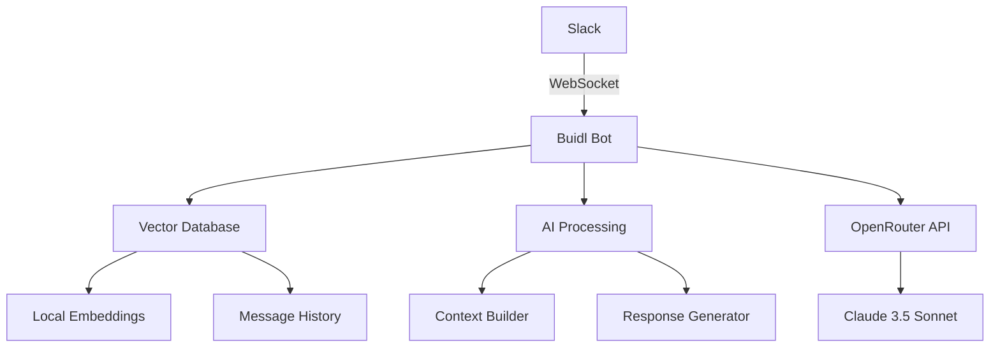

# Buidl Documentation
{: .fs-9 }

AI-powered dev bot that executes commands and builds things via Slack using vector embeddings and OpenRouter integration.
{: .fs-6 .fw-300 }

[Get started now](#getting-started){: .btn .btn-primary .fs-5 .mb-4 .mb-md-0 .mr-2 }
[View on GitHub](https://github.com/twilson63/buidl){: .btn .fs-5 .mb-4 .mb-md-0 }

---

## Key Features

### 🚀 WebSocket Support
Real-time bidirectional communication with **75-90% faster response times** (50-200ms vs 500-2000ms HTTP).

### 🧠 AI-Powered Responses  
Uses OpenRouter (Claude 3.5 Sonnet) for intelligent, context-aware conversations.

### 🔍 Vector Embeddings
Searches conversation history using semantic similarity for relevant context.

### 🔐 Privacy-First
Configurable privacy levels with local embedding options for maximum data protection.

### ⚡ High Performance
LSH indexing for sub-linear search performance and efficient message processing.

### 🔧 Easy Deployment
No public webhook URLs needed with Socket Mode - simplified networking and enhanced security.

---

## Getting Started

### Quick Installation

#### macOS (Pre-built Binary)
```bash
# Download and install
curl -L https://github.com/twilson63/buidl/releases/latest/download/buidl-v1.1.0-macos-arm64.tar.gz -o buidl.tar.gz
tar -xzf buidl.tar.gz
cd macos-arm64
./install.sh

# Configure
buidl-config

# Start bot
buidl
```

#### Any Platform (Source)
```bash
# Download source
curl -L https://github.com/twilson63/buidl/releases/latest/download/buidl-v1.1.0-source.tar.gz -o buidl-source.tar.gz
tar -xzf buidl-source.tar.gz
cd source

# Build (requires Hype framework)
./build.sh

# Configure and run
./buidl-config
./buidl-socket
```

### Next Steps

1. **[Configuration Guide](guides/configuration/)** - Set up your Slack app and API keys
2. **[WebSocket Setup](guides/websocket-setup/)** - Enable Socket Mode for real-time performance  
3. **[Deployment Guide](guides/deployment/)** - Deploy to production environments
4. **[API Reference](api/)** - Explore the full API documentation

---

## Architecture Overview



### Components

- **Slack Integration** - WebSocket Socket Mode or HTTP Events API
- **Vector Database** - Semantic search with privacy-conscious embeddings  
- **AI Processing** - Context-aware response generation
- **OpenRouter** - Claude 3.5 Sonnet integration for intelligent responses

---

## Performance Comparison

| Feature | HTTP Events API | Socket Mode |
|---------|----------------|-------------|
| **Latency** | 500-2000ms | 50-200ms |
| **Connection** | Stateless HTTP | Persistent WebSocket |
| **Deployment** | Complex (webhooks) | Simple (outbound only) |
| **Security** | Public endpoints | Outbound connections |
| **Development** | ngrok required | Local testing friendly |

---

## Community & Support

- **GitHub Issues**: [Report bugs and request features](https://github.com/twilson63/buidl/issues)
- **Discussions**: [Join the community discussion](https://github.com/twilson63/buidl/discussions)
- **Releases**: [Latest releases and changelogs](https://github.com/twilson63/buidl/releases)

---

## License

This project is licensed under the MIT License - see the [LICENSE](https://github.com/twilson63/buidl/blob/main/LICENSE) file for details.